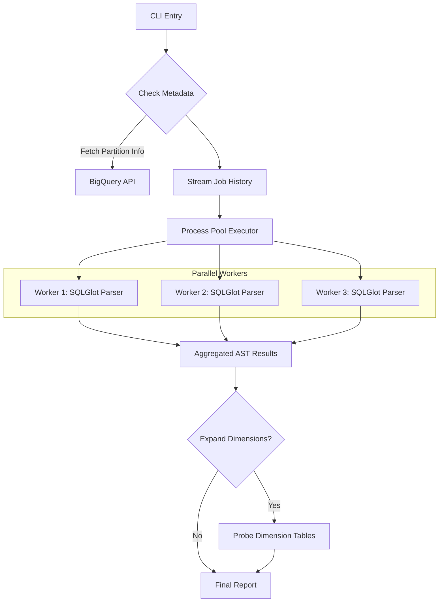

# BigQuery Partition Access Auditor

> [!IMPORTANT]
> **Production Status**: This tool is stable for AST-based partition pruning detection. "Dimension Expansion" mode is a Proof of Concept (PoC) and has known limitations regarding table alias resolution.

A diagnostic tool designed to identify and aggregate partition-level access patterns within BigQuery query history. This auditor utilizes **Abstract Syntax Tree (AST) analysis** to detect partition pruning, including transitive propagation across join boundaries, without executing the queries (zero compute cost for the audit itself).

## Core Characteristics

### 1. Zero-Cost SQL AST Analysis
The auditor employs a non-destructive AST traversal to identify literal filters associated with partitioned columns. By analyzing the structure of the query rather than relying on regex or string matching, it maintains high fidelity across complex SQL constructs such as Common Table Expressions (CTEs) and nested subqueries.

### 2. Dimension Expansion (PoC)
The auditor supports an optional data-aware expansion mode. When enabled, it identifies high-level filters on dimension tables (e.g., `d_year = 2023`) and probes the underlying dimension data to resolve the specific set of partitions accessed in the fact table.
*   **Status**: Experimental.
*   **Limitation**: Currently assumes the join key exists in the dimension table with the same name.

### 3. Parallel Execution Model
To process large volumes of historical job data (e.g., 100k+ queries), the auditor utilizes a distributed parsing model using `ProcessPoolExecutor`. Work is partitioned across available CPU cores (default: all cores), minimizing the total wall-clock time required for analysis.

## Architecture

### Data Flow



### Partition Pruning Logic

The tool detects pruning in three ways:
1.  **Direct Filtering**: `WHERE _PARTITIONDATE = '2024-01-01'`
2.  **Range Filtering**: `WHERE _PARTITIONDATE BETWEEN '2024-01-01' AND '2024-01-07'`
3.  **Set Filtering**: `WHERE _PARTITIONDATE IN ('2024-01-01', '2024-01-02')`

It normalizes all detected values into a standard `YYYYMMDD` format for aggregation.

## Installation

### Prerequisites
*   Python 3.12+
*   Google Cloud SDK (for authentication)
*   A BigQuery project with `bigquery.jobs.list` and `bigquery.tables.get` permissions.

### Quick Start
The tool is self-bootstrapping using `uv` (recommended) or `venv`.

1.  **Clone the repository**:
    ```bash
    git clone ...
    cd bigquery_partition_access_auditor
    ```

2.  **Run directly**:
    The script will automatically set up a virtual environment and install dependencies (`sqlglot`, `google-cloud-bigquery`, `pydantic`).
    ```bash
    python3 bq_partition_audit.py --help
    ```

## Usage

```bash
python3 bq_partition_audit.py --project <PROJECT_ID> --table <DATASET.TABLE> [OPTIONS]
```

### Arguments

| Flag | Required | Default | Description |
| :--- | :---: | :---: | :--- |
| `--project` | Yes | - | The Google Cloud project ID for billing/auditing context. |
| `--table` | Yes | - | Target table to audit (format: `project.dataset.table`). |
| `--days` | No | `7` | Number of past days of job history to analyze. |
| `--expand-dimensions` | No | `False` | **(Expensive)** Enable probing of dimension tables to resolve indirect partitions. |
| `--verbose` | No | `False` | Enable debug logging (prints full parsed SQL). |

### Example Output

```text
Auditing: my-project.analytics.events
Strategy: Parallel Parsing (CPUs=12)
------------------------------------------------------------
PARTITION_ID         | ACCESS_COUNT    | SOURCE_COLUMN/CONTEXT
------------------------------------------------------------
20231225             | 1450           | (from e.event_date)
20231226             | 320            | (from e.event_date)
20231227             | 15             | (expanded from d.holiday_name)
```

## Known Limitations

1.  **Join Key Resolution**:
    *   The expansion logic currently assumes the dimension table has a column matching the *fact table's join key*. If `fact.date_sk` joins on `dim.d_date_sk`, the probe query `SELECT fact_date_sk FROM dim` will fail.
    *   **Workaround**: Ensure consistent column naming or extend the `resolve_dimension_filter` method to accept mapping overrides.

2.  **Aliasing**:
    *   Complex aliasing in deeply nested subqueries might occasionally be missed if `sqlglot` cannot track the scope.

## License
Proprietary / Internal Use Only.
