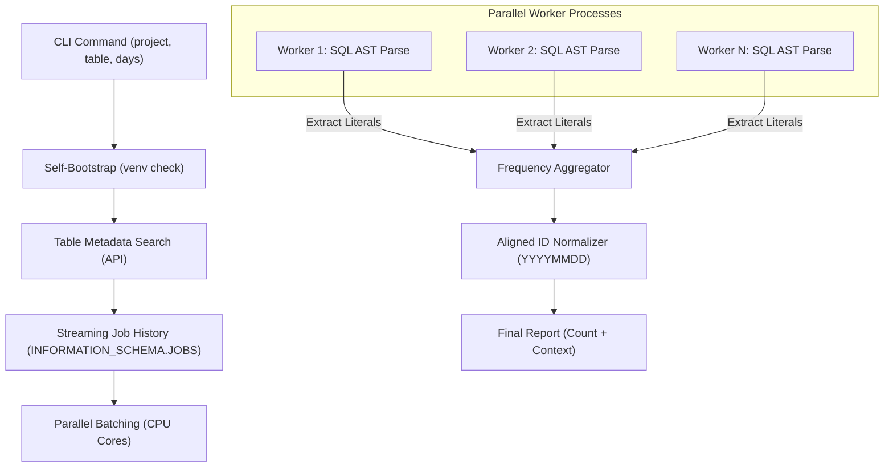

# BigQuery Partition Access Auditor

A high-performance, production-grade tool to identify specific partitions accessed by BigQuery queries over time. Designed for massive scale (millions of queries) and multi-join transitive pruning detection.

## 🚀 Key Features

- **Massive Scale**: Processes millions of queries using **Parallel AST Parsing** and **Streaming Metadata Retrieval**.
- **Transparent Parallelism**: Automatically detects CPU cores and scales out without manual configuration.
- **Deep Pruning Detection**: Identifies partitions even through multiple joins and nested CTEs using a Query-Wide Literal Scan.
- **Frequency Tracking**: Reports not just which partitions were touched, but **how many times** each was accessed.
- **Standards Aligned**: Output IDs match the BigQuery `partition_id` standard (`YYYYMMDD`).
- **Zero-Setup**: Self-bootstrapping script—just run it, and it handles its own environment.

## 🏗 How It Works

The auditor uses a multi-layered approach to ensure high-fidelity detection and high-performance execution.



## 🛠 Usage

```bash
python3 bq_partition_audit.py --project YOUR_PROJECT --table PROJECT.DATASET.TABLE --days 7
```

### Example Test Query (TPC-DS Style)
```sql
SELECT *
FROM `bigquerybench.tpcds_100G.catalog_sales` cs
JOIN `bigquerybench.tpcds_100G.date_dim` d ON cs.cs_sold_date_sk = d.d_date_sk
WHERE d.d_date = '2000-09-09'
```

### Auditor Output
```text
Auditing: bigquerybench.tpcds_100G.catalog_sales
Strategy: Optimized Parallel Parsing, Streaming Fetch

Identified Partitions (ID format: YYYYMMDD):
PARTITION_ID         | ACCESS_COUNT    | CONTEXT_EX
------------------------------------------------------------
20000909             | 1               | (from d.d_date)
```

## 🧠 Why Information Schema?

The auditor queries `INFORMATION_SCHEMA.JOBS.referenced_tables`. This is the most robust source because:
1. **Post-Resolution**: It reflects the actual base tables touched, even if the query used views.
2. **Deterministic**: It avoids false positives from SQL comments or similar-looking strings.

## 📦 Requirements
- Google Cloud SDK (authenticated)
- Python 3.10+
- (The script handles all package installations automatically!)
