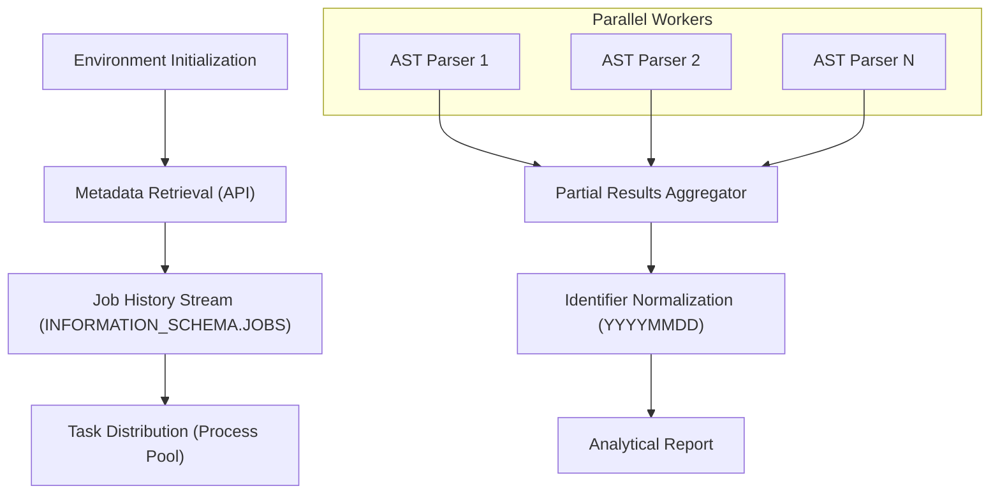

# BigQuery Partition Access Auditor

A diagnostic tool designed to identify and aggregate partition-level access patterns within BigQuery query history. This auditor utilizes abstract syntax tree (AST) analysis to detect partition pruning, including transitive propagation across join boundaries.

## Core Characteristics

### SQL AST Analysis
The auditor employs a non-destructive AST traversal to identify literal filters associated with partitioned columns. By analyzing the structure of the query rather than relying on string matching, it maintains high fidelity across complex SQL constructs such as Common Table Expressions (CTEs) and nested subqueries.

### Dimension Expansion (Gated)
The auditor supports an optional data-aware expansion mode. When enabled, it identifies high-level filters on dimension tables (e.g., month, year) and probes the underlying dimension data to resolve the specific set of partitions accessed in the fact table. This is disabled by default to minimize compute costs.

### Parallel Execution Model
To process large volumes of historical job data, the auditor utilizes a distributed parsing model. Work is partitioned across available CPU cores, minimizing the total wall-clock time required for analysis.

## Technical Design

### Architectural Data Flow



### Mathematical Foundation

#### Computation Complexity
The computational overhead of the audit process is primarily bounded by the SQL parsing phase. For a set of $Q$ queries, the time complexity $T$ can be approximated as:

$$T \approx \sum_{i=1}^{Q} O(N_i)$$

Where $N_i$ represents the number of nodes in the AST of the $i$-th query.

#### Parallel Efficiency
The system achieves speedup $S$ following Amdahl's Law, where $p$ is the parallelizable portion of the workload (SQL parsing) and $n$ is the number of processing cores:

$$S(n) = \frac{1}{(1-p) + \frac{p}{n}}$$

Given that the streaming of job history is a IO-bound sequential operation and AST parsing is a CPU-bound parallel operation, $p$ typically approaches $0.95$ for large query sets.

## Usage

The auditor is executed via the command-line interface with the following parameters:

```bash
python3 bq_partition_audit.py --project <AUDIT_PROJECT> --table <TARGET_TABLE> --days <WINDOW>
```

### Reporting Output
The tool produces a structured summary of accessed partitions, sorted by access frequency and chronological order:

```text
Auditing: project.dataset.table
Strategy: Optimized Parallel Parsing, Streaming Fetch

Identified Partitions (ID format: YYYYMMDD):
PARTITION_ID         | ACCESS_COUNT    | CONTEXT_EX
------------------------------------------------------------
20231024             | 142             | (from d.date_col)
20231025             | 89              | (from f._PARTITIONDATE)
```

## Requirements
- Google Cloud SDK (Authenticated)
- Python 3.12+
- The execution environment is self-bootstrapping; required libraries (`sqlglot`, `pydantic`, `google-cloud-bigquery`) are automatically managed within a localized virtual environment.
